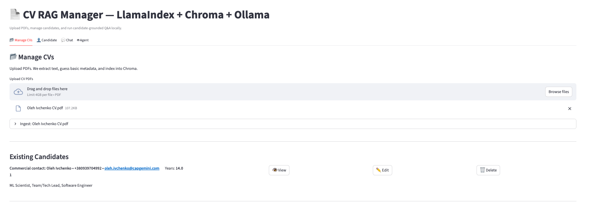
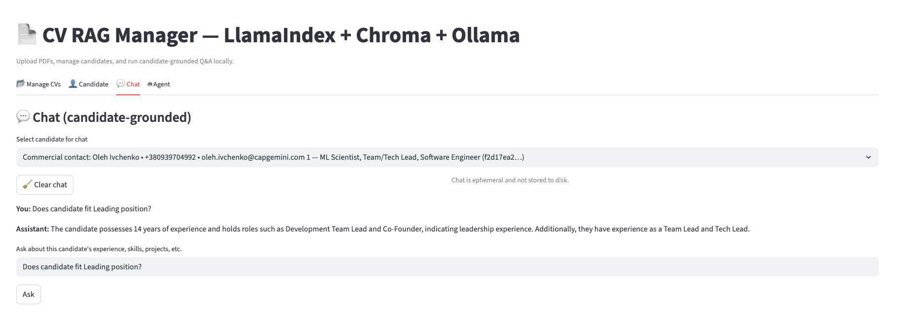
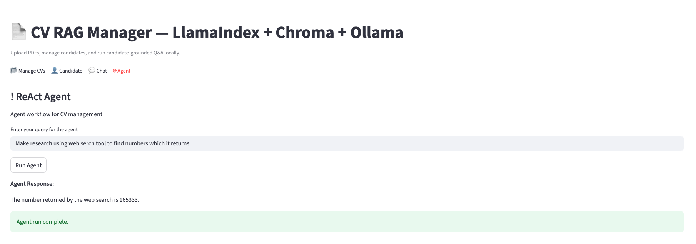

# Candidates Review Application

A Streamlit-based application for reviewing and analyzing candidate documents using AI-powered document processing and retrieval.

# Data Ingestion

# LLM Summary

# RAG chat

# ReAct Agent with tools


## Features

- PDF document processing and analysis
- Vector-based document search and retrieval
- AI-powered candidate evaluation
- Interactive web interface built with Streamlit
- Support for multiple LLM backends (Ollama, Google Gemini)

## Prerequisites

- Python 3.8 or higher
- Ollama (embeddings and model for RAG and chat)
- Google API key (Gemini is working with ReAct agent while Ollama can not)

## Installation

1. Clone this repository:
```bash
git clone <your-repository-url>
cd candidates-review-app
```

2. Install the required dependencies:
```bash
pip install -r requirements.txt
```

3. Set up your environment variables:
```bash
export OPENAI_API_KEY=your_openAI_api_key_here
export GOOGLE_API_KEY=your_google_api_key_here #change ensure_llamaindex_settings() function to switch provider
```

Alternatively, you can create a `.env` file in the project root:
```
GOOGLE_API_KEY=your_google_api_key_here
```

## Usage

1. Start the Streamlit application:
```bash
streamlit run app.py
```

2. Open your web browser and navigate to the URL shown in the terminal (typically `http://localhost:8501`)

3. Upload candidate documents (PDF format supported) and start reviewing!

## Configuration

The application supports multiple LLM backends:
- **Ollama**: For local LLM processing
- **Google Gemini**: For cloud-based AI processing (requires API key)

## Project Structure

```
├── app.py              # Main Streamlit application
├── tools.py            # ReAct Agent implementation
├── rag.py              # RAG implementation
├── requirements.txt    # Python dependencies
├── README.md           # This file
└── ...                 # Additional project files
```

## Dependencies

- `streamlit` - Web application framework
- `pypdf` - PDF processing
- `llama-index` - Document indexing and retrieval
- `chromadb` - Vector database
- Additional LlamaIndex components for LLM and embedding support

## Contributing

1. Fork the repository
2. Create a feature branch
3. Make your changes
4. Submit a pull request

## License

TBD

## Support

For issues and questions, please create an issue in the repository or contact the development team.